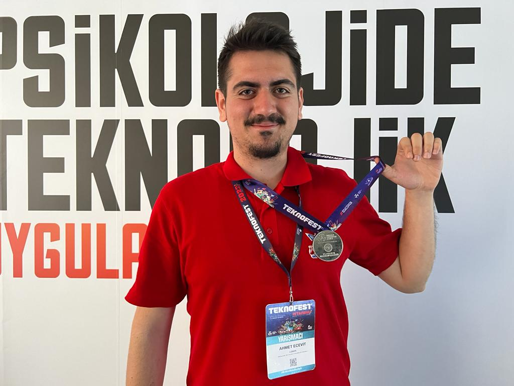

<!--Cover -->

  
    
  <!--Social Media -->
  

    <a href="https://www.instagram.com/eecevah" target="_blank"><a/>
    <a href="https://www.linkedin.com/in/ahmet-ecevit/" target="_blank"><a/>
    <a href="https://www.ahmetecevit.com" target="_blank"><a/>
  
 
  
  <h2>About Me</h2>
   
  
<strong>Hello everyone, I'm Ahmet- 24 years old Turkish coder   
    📚 I am currently developing Web Technologies</li>  
    ⚡ Always ready to collaborate for modern projects and communities | Next.js stacks preferred  
    🎯 Motivation to become a Modernist Web Developer
  

<!--Arrow Gif-->

<!--Technologies -->
  <h2 align="center">Languages & Tools</h2>
   
  

    
    
    
    
    
    
    
    

  

<!--Visitor Counter-->

  

